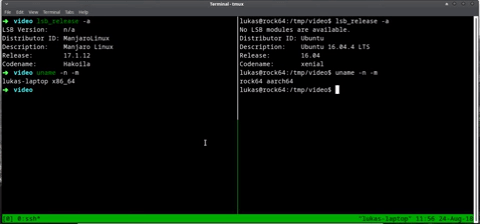

# Mailman

Mailman is designed for unix-like users who want to share either small or big files without any hassle. Even though it's a very simple program, it still gives you a lot of flexibility by using the **stdin** and **stdout**, meaning you can use **pipe, compression, archive, etc!**

This is how the data flow looks like:

##### stdin -----> mailman send (peer 1) -------- local network --------> mailman recv (peer 2) -----> stdout

## Features

* Peer-to-peer networking (**no centralized server!**)
* Auto peer discovery
* Simple
* Unix-like

## Requirement

Since **mailman** is peer-to-peer, there are some limitations:

1. The **sender** and **receiver** have to be in the **same network**

## Installing

1. Go to the (release page](https://github.com/lherman-cs/mailman/releases)
2. Get the latest release for your OS and architecture
3. Untar it
4. And.. done. You can simply run the executable file, **mailman**

## Contributing

Please feel free to contribute by making issues or PRs. I'll review them as quickly as possible.

## Authors

* **Lukas Herman** - *Initial work* - [lherman-cs](https://github.com/lherman-cs)

## License

This project is licensed under the Apache 2.0 License - see the [LICENSE](LICENSE) file for details
